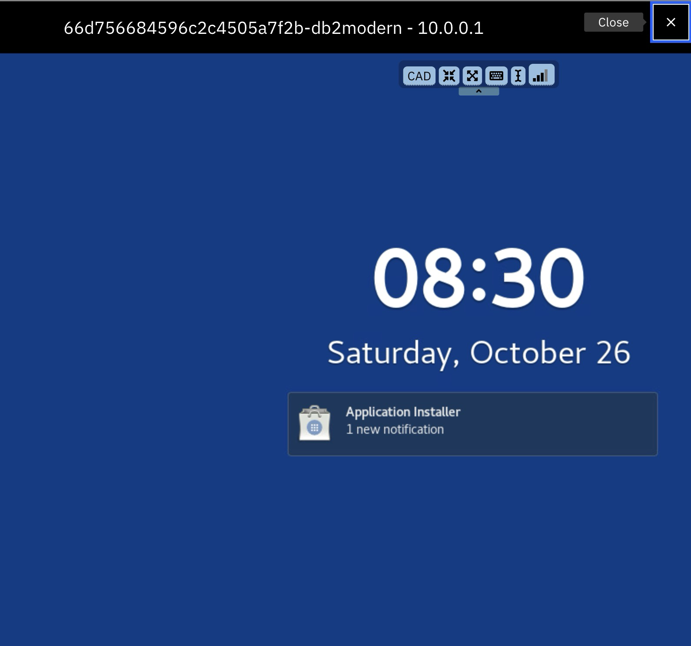
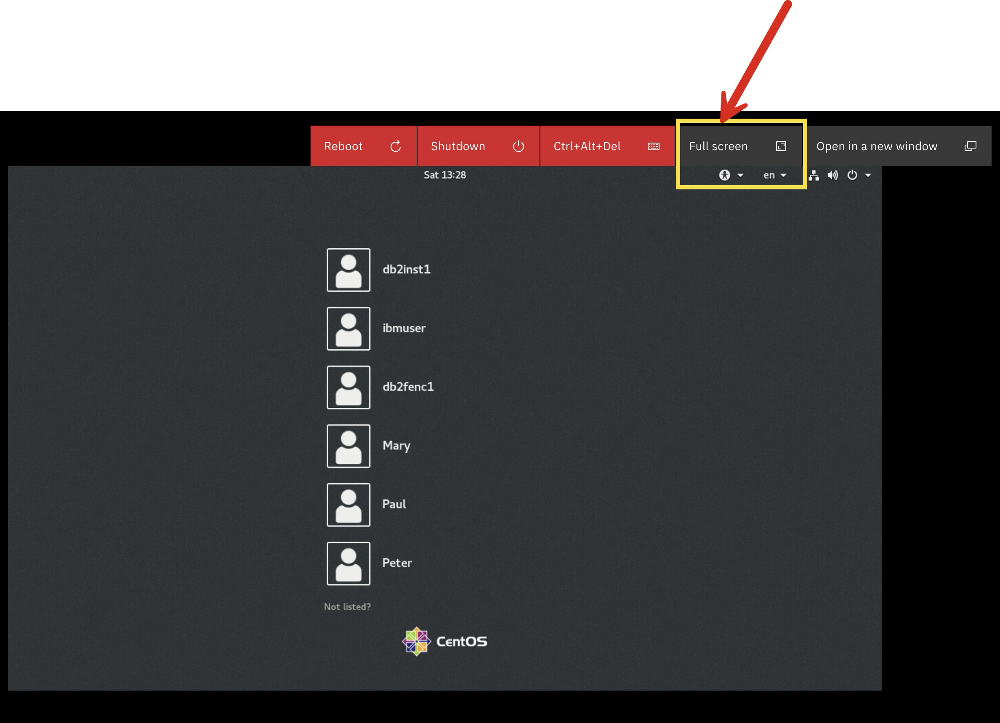
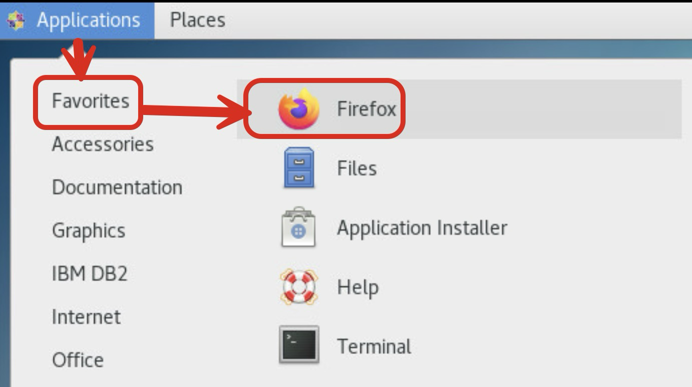

# IDUG EMEA 2024 - Db2 Machine Learning Workshop Instructions

## 1. Requesting an IBM id
Go to this page and register for an IBMid: [Create an IBMid](https://www.ibm.com/account/reg/us-en/signup?formid=urx-19776)

**If you already have an IBMid, you can skip ahead to the next section (step 2).**

You'll you fill in a 2-page form and submit the form. It doesn't require any credit card to get an IBM id. 

Complete page 1 of the IBM id request form and click next. 

Here's a screenshot of page 1. 


After you clicking next on page 1, the registration process will send a 7 digit verification token to the email address you entered on page 1. Copy that token and enter this on the 2nd page of the registration form below and click `Submit`.


Shortly after you'll receive an email such as the following with a confirmation that your IBM id has been created. 


Remember your IBM id and password in a secure place. You'll need them for requesting and accessing a Db2 ML workshop VM. 

It will take a couple minutes to submit the form and get an IBM id. 

Once you have an IBM id and its password, go to the next step. 

## 2. Accessing Your Workshop VM
Go to workshop attendee's page by clicking [this](https://techzone.ibm.com/my/workshops/student/6710247b242dbc7351ebe218) link.

It will ask you to sign in using your IBM id and password. Enter your IBM credentails and log in. After you reach the Workshop Attendee's page, you will see the following form. In this form, enter the workshop access code that you received from your instructor and click `Submit password/access code` button. 


you'll be taken to the 


Next, this process will assign a workshop VM to your IBM id and direct you to your VM environment page as follows:


On the `Your environment` page, scroll down until you see a section called `VM Remote Console`. Click the blue console link. 


Clicking the blue console link will launch the following login window to your workshop VM. From this window, click `Open in a new window` to open this in a full-size browser tab, which will be easier to work with. 


From this expanded login window, log in as db2inst1 user with the password that your instructor has provided you. 

In case you don't see the login usernames, instead see a bluescreen like the following, click anywhere in the blue area of this window and press `esc` from your keyword. This will bring up the list of users, including `db2inst11`. 



## 3. Setting up your VM
Now, you're inside your VM GUI. 

Open a terminal:


 Open `/etc/hosts` file as a root user:
```shell
sudo vi /etc/hosts
```

The file has the following content:


Switch to edit model by pressing `i` in your keyboard. By pressing left arrow in your keyboard, move your cursor to the beginning of the list of server names after `127.0.0.1`. Add to this list `server7`. 


In your keyboard, press the `esc` key and then type `:wq`. This will save the update you just made in the `/etc/hosts` file. 

Now, restart the VM by going to the browser tab in your laptop that looks like the following. Click `Reboot`.


You'll see window asking you to confirm that you want to reboot the VM. Confirm by clicking `YES`. 


Wait for 15-20 seconds for reboot to complete. Once the reboot completes, click the `Full screen` button to open the VM in a full screen model. In full screen mode, log into the VM as `db2inst1`. 



From the VM's desktop, go to `Applications` -> `Favorite` -> `Firefox` as follows:



Using firefox, open ibm.biz/idug2024


## 4. Downloading the Workshop Code


2. Download lab code from db2ml-labs repo:

Select the following shell command and copy from right clicking and then copying to clipboard. Next, paste the copied command into the terminal in the VM. You can launch the terminal from `Applications` -> `Favorites` -> `Terminal`.

```shell
git clone -b idugemea2024 --single-branch https://github.com/shaikhq/db2ml-labs.git
```

Type `ls` to see the git repo folder, `db2ml-labs`, that you just downloaded. 
```shell
ls
```


Go to `db2ml-labs` directory:
```shell
cd db2ml-labs
```

See the content of `db2ml-labs` directory:
```shell
ls
```


- `module1-idax` directory has the content of the first lab where you'll use Db2's in-database advanced analytics (IDAX) stored 
procedures for developing a machine learning (ML) model.

- `module2-vectors` directory has the content of the second lab where you'll implement a vector similarity search use case with Db2.

# 5 Module 1: Building a Linear Regression Model using in-database machine learning stored procedures at Db2

Navigate to ~/db2ml-labs/module1-idax:
```shell
cd ~/db2ml-labs/module1-idax
```

At the `module1-idax` folder, run the following script to create the Db2 table and load data into it for the current exercise. 

```shell
./dbsetup.sh banking
```

**Using terminal, connect to Db2 command line tool in multiline mode:**
```shell
db2 -t
```

**At Db2 command line tool, connect to the banking database**
```sql
connect to banking;
```

Now, at the db2 command line, run the following series commands for the current exercise:

**1. Train / Test Split**
```sql
CALL IDAX.SPLIT_DATA('intable=GOSALES, id=ID, traintable=GOSALES_TRAIN, testtable=GOSALES_TEST, fraction=0.8, seed=1');
```
**1a. Checking the # of rows in TRAIN partition**
```sql
SELECT count(*) FROM GOSALES_TRAIN;
```

**1b. Checking the # of rows in the TEST partition**
```sql
SELECT count(*) FROM GOSALES_TEST;
```

2. Data exploration
**2a. looking sample rows from the TRAIN partition**
```sql
SELECT * FROM GOSALES_TRAIN FETCH FIRST 5 ROWS ONLY;
```

**2b. generating summary statistics**
```sql
CALL IDAX.SUMMARY1000('intable=GOSALES_TRAIN, outtable=GOSALES_TRAIN_SUM1000, incolumn=GENDER;AGE;MARITAL_STATUS;PROFESSION');
```

**2b. looking at summary statistics of numeric columns**
```sql
SELECT * FROM GOSALES_TRAIN_SUM1000_NUM;
```

**2c. looking at summary statistics of non-numeric columns**
```sql
SELECT * FROM GOSALES_TRAIN_SUM1000_CHAR;
```

**3. Data preprocessing**
**3a. replacing missing values in the AGE column**
```sql
CALL IDAX.IMPUTE_DATA('intable=GOSALES_TRAIN, incolumn=AGE, method=mean');
```

**3b. replacing missing values in the GENDER column**
```sql
CALL IDAX.IMPUTE_DATA('intable=GOSALES_TRAIN, method=replace, nominalValue=M, incolumn=GENDER');
```

**3c. replacing missing values in the MARITAL_STATUS column**
```sql
CALL IDAX.IMPUTE_DATA('intable=GOSALES_TRAIN, method=replace, nominalValue=Married, incolumn=MARITAL_STATUS');
```

**3d. replacing missing values in the PROFESSION column**
```sql
CALL IDAX.IMPUTE_DATA('intable=GOSALES_TRAIN, method=replace, nominalValue=Other, incolumn=PROFESSION');
```

**3e. confirming that the above 4 columns have no more missing values**
**GENDER column**
```sql
SELECT count(*) FROM GOSALES_TRAIN WHERE AGE IS NULL;
```
**MARITAL_STATUS:**
```sql
SELECT count(*) FROM GOSALES_TRAIN WHERE MARITAL_STATUS IS NULL;
```
**PROFESSION:**
```sql
SELECT count(*) FROM GOSALES_TRAIN WHERE PROFESSION IS NULL;
```

**4. Model training**
```sql
CALL IDAX.LINEAR_REGRESSION('model=GOSALES_LINREG, intable=GOSALES_TRAIN, id=ID, target=PURCHASE_AMOUNT,incolumn=AGE;GENDER;MARITAL_STATUS;PROFESSION, intercept=true');
```

**4a. list trained models**
```sql
CALL IDAX.LIST_MODELS('format=short, all=true');
```

**4b. checking the model's learned coefficients**
```sql
SELECT VAR_NAME, LEVEL_NAME, VALUE FROM GOSALES_LINREG_MODEL;
```

**5. Generating prediction with the trained model**
**5a. filling in missing values in the test dataset, GOSALES_TEST**
**AGE:**
```sql
CALL IDAX.IMPUTE_DATA('intable=GOSALES_TEST, method=mean, incolumn=AGE');
```
**GENDER:**
```sql
CALL IDAX.IMPUTE_DATA('intable=GOSALES_TEST, method=replace, nominalValue=M, incolumn=GENDER');
```
**MARITAL_STATUS**
```sql
CALL IDAX.IMPUTE_DATA('intable=GOSALES_TEST, method=replace, nominalValue=Married, incolumn=MARITAL_STATUS');
```
**PROFESSION**
```sql
CALL IDAX.IMPUTE_DATA('intable=GOSALES_TEST, method=replace, nominalValue=Other, incolumn=PROFESSION');
```
**5b. generating predictions**
```sql
CALL IDAX.PREDICT_LINEAR_REGRESSION('model=GOSALES_LINREG, intable=GOSALES_TEST, outtable=GOSALES_TEST_PREDICTIONS, id=ID');
```
**5c. checking sample predictions**
```sql
SELECT * FROM GOSALES_TEST_PREDICTIONS FETCH FIRST 5 ROWS ONLY;
```

**6. Model evaluation**
**6a. MSE**
```sql
CALL IDAX.MSE('intable=GOSALES_TEST, id=ID, target=PURCHASE_AMOUNT, resulttable=GOSALES_TEST_PREDICTIONS, resulttarget=PURCHASE_AMOUNT');
```
**6b. MAE**
```sql
CALL IDAX.MAE('intable=GOSALES_TEST, id=ID, target=PURCHASE_AMOUNT, resulttable=GOSALES_TEST_PREDICTIONS, resulttarget=PURCHASE_AMOUNT');
```
**6c. MAPE:**
```sql
SELECT avg(abs(A.PURCHASE_AMOUNT - B.PURCHASE_AMOUNT) / A.PURCHASE_AMOUNT * 100) AS MAPE FROM GOSALES_TEST AS A, GOSALES_TEST_PREDICTIONS AS B WHERE A.ID = B.ID;
```

**7. Dropping the model**
**Drop:**
```sql
CALL IDAX.DROP_MODEL('model=GOSALES_LINREG');
```

**Confirming that the model was dropped:**
```sql
CALL IDAX.LIST_MODELS('format=short, all=true');
```

**Quit from Db2 command line tool**
```sql
quit;
```

## 6. Module 2 - Vectors with Db2
**1. Navigate to module 2 lab folder**
****
```shell
cd ~/db2ml-labs/module2-vectors
```

**2. setup patient table - create table and load data**
```shell
./1-dbsetup.sh sample
```

**3. build and register vector user-defined functions (UDFs)**
```shell
./2-buildudfs.sh sample
```

**4. load vectors to the patients table**
```shell
./3-loadvectors.sh sample
```

**5. Using terminal, launch db2 command line with multiline support**
```shell
db2 -t
```

**6. At the db2 command line, connect to the sample database**
```sql
connect to sample
```

**7 Now, at the db2 command line, run the following commands:**

**7a. View sample rows from the PATIENTS table**
```sql
SELECT * FROM PATIENTS FETCH FIRST 5 ROWS ONLY;
```

**7b. vector dimension**
```sql
SELECT NAME, VECTOR_LEN(VECTOR) FROM PATIENTS FETCH FIRST 3 ROWS ONLY;
```

**7c. vector distance**
```sql
SELECT NAME, AGE, GENDER, CHOLESTEROL_LEVEL, SMOKING_STATUS, VECTOR_DISTANCE((SELECT VECTOR FROM PATIENTS WHERE PATIENT_ID = 2), VECTOR) as SIMILARITY
FROM PATIENTS
WHERE PATIENT_ID <> 2
ORDER BY SIMILARITY DESC
FETCH FIRST 3 ROWS ONLY
```

**7d. unpack vector**
```sql
SELECT NAME, VEC_TO_CHAR(VECTOR) as VECTOR FROM PATIENTS WHERE PATIENT_ID = 2
```

**7e. disconnect from Db2 command line tool**
```sql
quit;
```


## Misc - No Action Needed
Resetting local git repo with remote repo:
```shell
git fetch --all
git reset --hard origin/main
```
