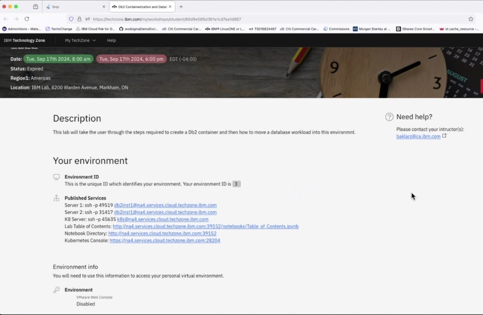
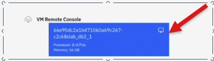
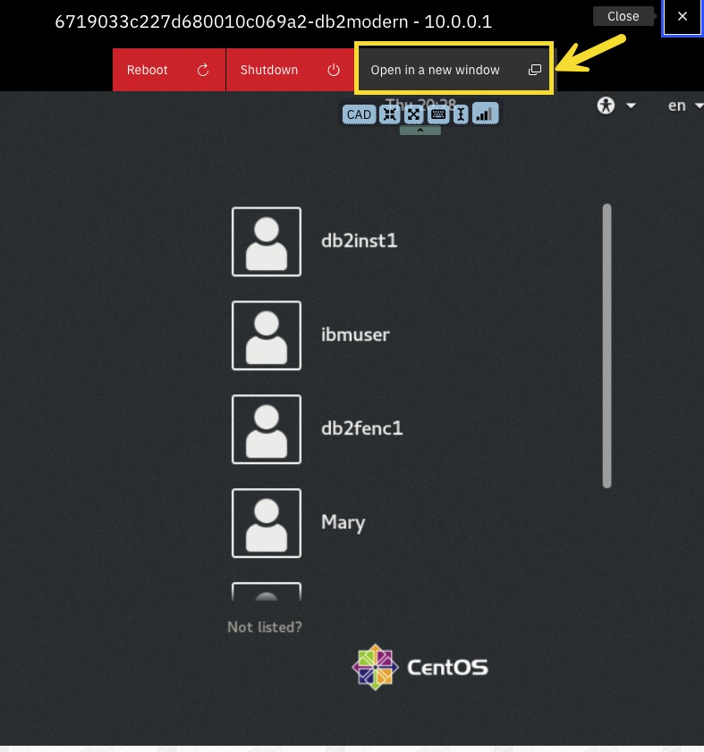
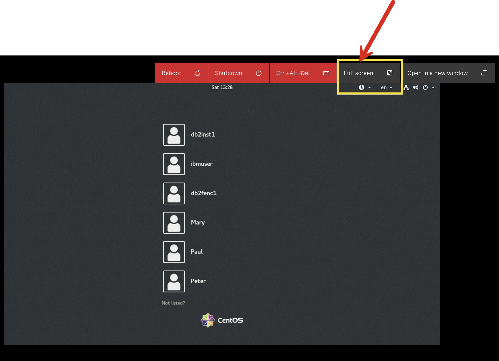
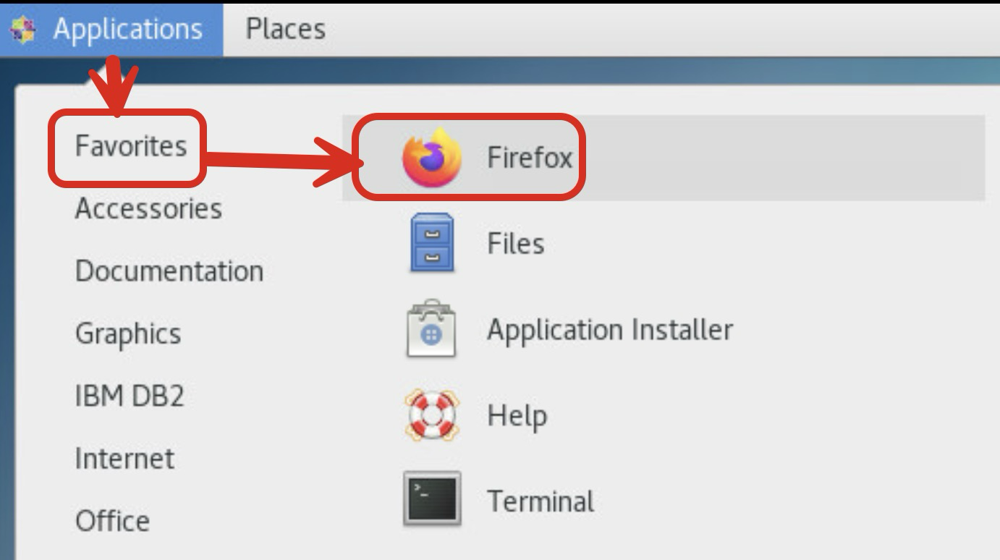
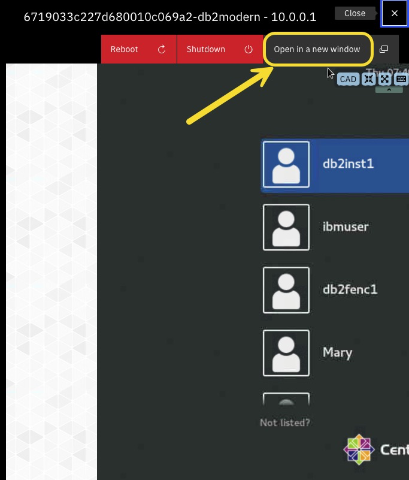

# db2ml
training modules for Db2 ML workshop

# 1. Requesting an IBM id
- Go to this page and register for an IBMid: [Create an IBMid](https://www.ibm.com/account/reg/us-en/signup?formid=urx-19776)

It will take a couple minutes to submit the form and get an IBM id. 

Once you have an IBM id and its password, go to the next step. 

# 2. Accessing Your Workshop VM
Go to workshop attendee's page by either clicking [this](https://techzone.ibm.com/my/workshops/student/6710247b242dbc7351ebe218) or typing on your browser https://ibm.biz/idug2024


It will ask you to sign in using your IBM id and password. Enter your IBM credentails and log in. After you reach the Workshop Attendee's page, you will see the following form. In this form, enter the workshop access code that you received from your instructor and click `Submit password/access code` button. 


you'll be taken to the 


Next, this process will assign a workshop VM to your IBM id and direct you to your VM environment page as follows:



On the `Your environment` page, scroll down until you see a section called `VM Remote Console`. Click the blue console link. 




Clicking the blue console link will launch the following login window to your workshop VM. From this window, click `Open in a new window` to open this in a full-size browser tab, which will be easier to work with. 



From this expanded login window, log in as db2inst1 user with the password that your instructor has provided you. 

# 3. Setting up your VM
Now, you're inside your VM GUI. 

Open a terminal:


 Open `/etc/hosts` file as a root user:
```shell
sudo vi /etc/hosts
```

The file has the following content:


Switch to edit model by pressing `i` in your keyboard. By pressing left arrow in your keyboard, move your cursor to the beginning of the list of server names after `127.0.0.1`. Add to this list `server7`. 


In your keyboard, press the `esc` key and then type `:wq`. This will save the update you just made in the `/etc/hosts` file. 

Now, restart the VM by going to the browser tab in your laptop that looks like the following. Click `Reboot`.



You'll see window asking you to confirm that you want to reboot the VM. Confirm by clicking `YES`. 



Wait for 15-20 seconds for reboot to complete. After the reboot finishes, click `Open in a new window` button. 



Login to your VM as `db2inst1` using the password that your instructor has given you. 

# 4. Downloading the Workshop Code

2. Download lab code from db2ml-labs repo:
```shell
git clone https://github.com/shaikhq/db2ml-labs.git
```

3. Type `ls` to see the git repo folder, `db2ml-labs`, that you just downloaded. 
```shell
ls
```


4. Go to `db2ml-labs` directory:
```shell
cd db2ml-labs
```

5. See the content of `db2ml-labs` directory:
```shell
ls
```


- `module1-idax` directory has the content of the first lab where you'll use Db2's in-database advanced analytics (IDAX) stored 
procedures for developing a machine learning (ML) model.

- `module2-vectors` directory has the content of the second lab where you'll implement a vector similarity search use case with Db2.
