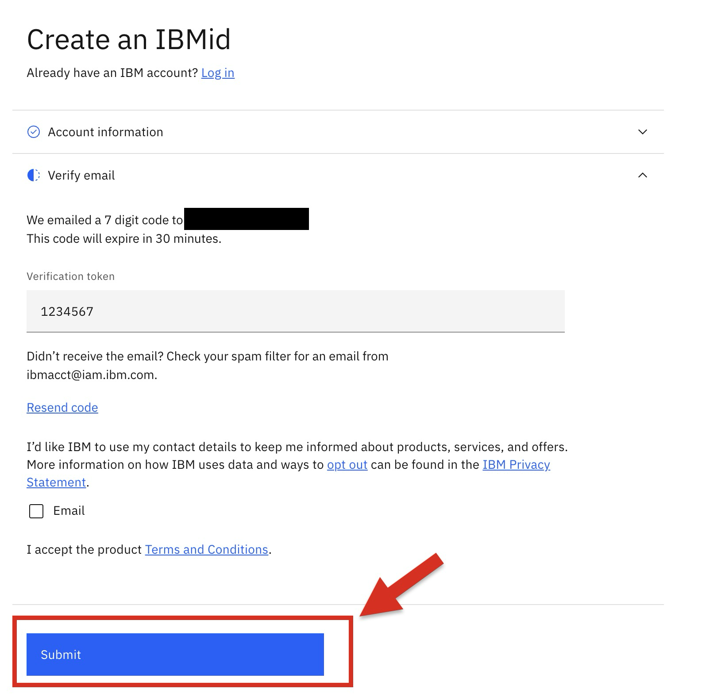

# IDUG EMEA 2024 - Db2 Machine Learning Workshop Instructions

## 1. Requesting an IBM id
Go to this page and register for an IBMid: [Create an IBMid](https://www.ibm.com/account/reg/us-en/signup?formid=urx-19776)

You'll you fill in a 2-page form and submit the form. It doesn't require any credit card to get an IBM id. 

Complete page 1 of the IBM id request form and click next. 


After you clicking next on page 1, the registration process will send a 7 digit verification token to the email address you entered on page 1. Copy that token and enter this on the 2nd page of the registration form below and click `Submit`.



Shortly after you'll receive an email such as the following with a confirmation that your IBM id has been created. 


Remember your IBM id and password in a secure place. You'll need them for requesting and accessing a Db2 ML workshop VM. 

It will take a couple minutes to submit the form and get an IBM id. 

Once you have an IBM id and its password, go to the next step. 

## 2. Accessing Your Workshop VM
Go to workshop attendee's page by either clicking [this](https://techzone.ibm.com/my/workshops/student/6710247b242dbc7351ebe218) link.

It will ask you to sign in using your IBM id and password. Enter your IBM credentails and log in. After you reach the Workshop Attendee's page, you will see the following form. In this form, enter the workshop access code that you received from your instructor and click `Submit password/access code` button. 


you'll be taken to the 


Next, this process will assign a workshop VM to your IBM id and direct you to your VM environment page as follows:


On the `Your environment` page, scroll down until you see a section called `VM Remote Console`. Click the blue console link. 


Clicking the blue console link will launch the following login window to your workshop VM. From this window, click `Open in a new window` to open this in a full-size browser tab, which will be easier to work with. 


From this expanded login window, log in as db2inst1 user with the password that your instructor has provided you. 

In case you don't see the login usernames, instead see a bluescreen like the following, click anywhere in the blue area of this window and press `esc` from your keyword. This will bring up the list of users, including `db2inst11`. 


## 3. Setting up your VM
Now, you're inside your VM GUI. 

Open a terminal:


 Open `/etc/hosts` file as a root user:
```shell
sudo vi /etc/hosts
```

The file has the following content:


Switch to edit model by pressing `i` in your keyboard. By pressing left arrow in your keyboard, move your cursor to the beginning of the list of server names after `127.0.0.1`. Add to this list `server7`. 


In your keyboard, press the `esc` key and then type `:wq`. This will save the update you just made in the `/etc/hosts` file. 

Now, restart the VM by going to the browser tab in your laptop that looks like the following. Click `Reboot`.


You'll see window asking you to confirm that you want to reboot the VM. Confirm by clicking `YES`. 


Wait for 15-20 seconds for reboot to complete. After the reboot finishes, click `Open in a new window` button. 


Login to your VM as `db2inst1` using the password that your instructor has given you.


## 4. Downloading the Workshop Code


2. Download lab code from db2ml-labs repo:

```shell
git clone -b idugmemea2024 --single-branch https://github.com/shaikhq/db2ml-labs.git
```

Now, we'll show you the way of copying this line of code from your laptop to the VM. 
First, copy the text to your laptop's clipboard. 


Next, switch to the VM window and click the place where you want to paste the copied code. In this case, you'll paste this copied command to the shell windown in the VM:


From the top center of your VM browser window, click the `send text` button below:


You'll see the following `send text` window. Here paste the copied shell command from the clipboard. Click `Fast Send Text` button and close the `Send Text` window by clicking the `x` on the top right corder of the the window. 


Now, the line of code will be copied to the shell prompt at your VM. Press enter to execute the command, which will download the workshop labs code from git repo to your VM. 

3. Type `ls` to see the git repo folder, `db2ml-labs`, that you just downloaded. 
```shell
ls
```


4. Go to `db2ml-labs` directory:
```shell
cd db2ml-labs
```

5. See the content of `db2ml-labs` directory:
```shell
ls
```


- `module1-idax` directory has the content of the first lab where you'll use Db2's in-database advanced analytics (IDAX) stored 
procedures for developing a machine learning (ML) model.

- `module2-vectors` directory has the content of the second lab where you'll implement a vector similarity search use case with Db2.

# 5 Module 1: Building a Linear Regression Model using in-database machine learning stored procedures at Db2


## Misc - No Action Needed
Resetting local git repo with remote repo:
```shell
git fetch --all
git reset --hard origin/main
```
